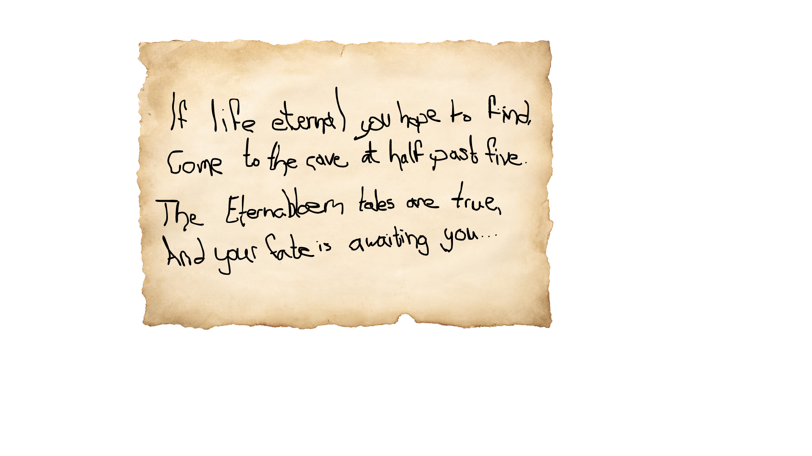

## The Pitch

Irven the Alchemist is on a quest for eternal life when his faithful (and rather dimwitted) sidekick Umbra, a shadow gremlin, is kidnapped. To get him back, Irven has to team up with his rival, **Ferox the assassin**, and each of them has to lean on the other's strengths when their own skills run out.

## Core Mechanic: Two Characters, One Player

The game is built on a **character swap** (`Q`). The two characters are designed to be incomplete on their own:

| | Ferox, the Assassin | Irven, the Alchemist |
| --- | --- | --- |
| Fantasy | Swift and nimble | Potion mastery |
| Verbs | Dash, wall jump | Potion of strength |
| Solves | Traversal: gaps, heights, speed | Obstacles: things that need raw power |

Each level is a puzzle about *who* should handle each section, which ties the mechanics to the story's theme of rivals learning to rely on each other. Both halves of the jam theme are in the premise: the alchemist and the shadow gremlin.

## My Role

I was the **designer, programmer and producer** on a five-person team, which meant owning the mechanics and level flow while keeping the scope shippable within the jam.

| Role | Team member |
| --- | --- |
| Design, programming, production | Delauraen (me) |
| Art & animation | Ansley (Yelsna) |
| Narrative, scripting, voice acting | Bri Duin (MeantToBri) |
| Audio | Matt (Catharticmeat) |
| Programming | Vandorino |

<!--
TODO(Laura): Add in your own words:
- How you designed a level that *requires* swapping (a sketch or screenshot of one puzzle would be great)
- What you cut to hit the deadline, and why
- Something playtesters got stuck on and how you responded (the "Restart" button suggests a story!)
-->
