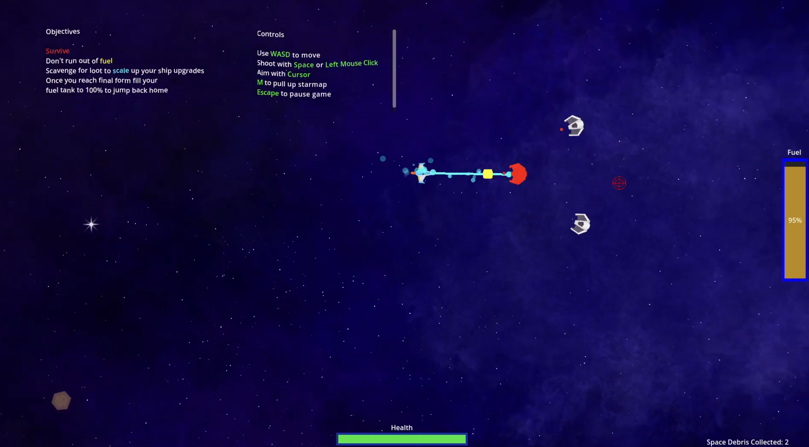

## The Pitch

Your ship is broken, your fuel is running out, and space pirates and aliens stand between you and home. Race To Repair is an arcade-style twin-stick shooter: **rebuild, refuel, return home.**

## Designing for "Built to Scale"

We read the jam theme through ship progression. The player starts as a barely functioning wreck and grows by scavenging:

- **Survive.** Pirates and aliens pressure the player constantly.
- **Don't run out of fuel.** Fuel drains over time, so it works as both a resource and a timer. You can't hide in a corner forever.
- **Scavenge to scale up.** Destroyed enemies and debris drop loot that powers ship upgrades.
- **Earn the jump home.** Once the ship reaches its final form, the player fills the tank to 100% to escape. That makes fuel the win condition as well as the thing keeping you alive.

The fuel gauge carries most of the design. It pushes the player toward fights they'd otherwise avoid, and at the end it becomes the goal.

## My Role

I was the **designer and programmer**. I owned the core loop, the upgrade progression and the Godot implementation, and worked with a returning jam team:

| Role | Team member |
| --- | --- |
| Programming & design | Delauraen (me) |
| Art | Ansley |
| Narrative | MeantToBri |
| Programming | Vandorino |

<!--
TODO(Laura): Add 2–3 short paragraphs in your own words. Hiring managers read these closely:
- One design decision you'd defend (e.g. why fuel drains passively instead of per-shot)
- Something playtesting changed
- What you'd do with another week
-->
