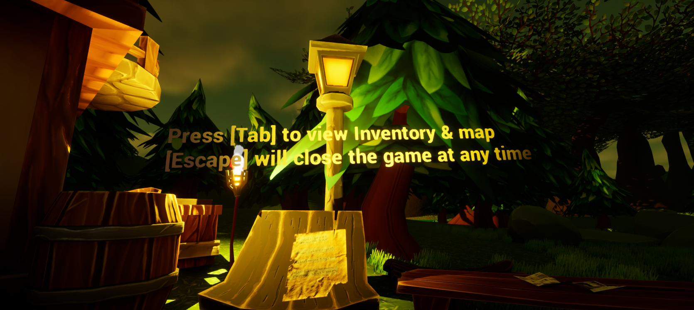

## The Pitch

A day in the life of a freshly graduated witch who has just found an ancient scroll that can summon a demon. Explore the swamp, gather the ingredients, bring them back to your cauldron, and **summon something all-powerful.**

## Designing for "Summoning"

We made the summoning the *destination* rather than the mechanic. The loop is explore → collect → return:

- **Explore.** A hand-built swamp with landmarks (docks, glowing mushrooms, lanterns and ruins) to help players navigate.
- **Collect.** Ingredients scattered through the space, tracked in an inventory.
- **Return.** Everything leads back to the cauldron, where the spell comes together.

An inventory and minimap (`Tab`) keep players oriented in the open 3D space, which matters in a jam game where players spend minutes with it, not hours.

![A glowing lamppost above a note on a tree stump, with floating tutorial text: "Press [Tab] to view Inventory & map. [Escape] will close the game at any time"](../../assets/games/witches-brew-2.png)

## My Role

I was the **programmer and designer** on a three-person team.

| Role | Team member |
| --- | --- |
| Programming & design | Delauraen (me) |
| Level design, audio, main theme | Catharticmeat |
| Writing & narrative | MeantToBri |

<!--
TODO(Laura): Add the engine (`engine:` in the frontmatter) plus your own reflections:
- How you taught controls in-world (the floating tutorial text) vs. a menu
- How ingredient placement guides the player through the swamp
-->
