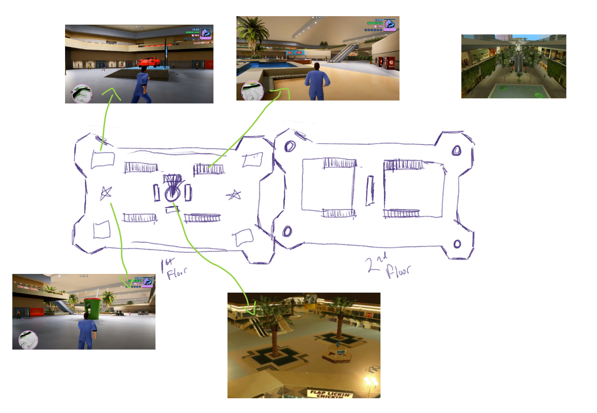

## The Pitch

After failing her dream trick, the 9000, Gretchen Goose is visited by the God of Skateboarding. The god thinks skateboarding has lost its chaos and gives her an ultimatum: **cause enough destruction and get another shot at the 9000.** Skate, grind and smash your way through the Boardopolis mall before time runs out.

The theme was *You Are the Enemy*, so the player is the problem. The score comes from how much damage you do.

## Level Design: Boardopolis Mall

The main level is a two-floor mall built for skate lines. I sketched out the layout from real-world reference so the space would feel recognisable and full of things to grind and break.

Goals for the layout:

- **A readable hub.** A central feature anchors the first floor so players can orient themselves at speed.
- **Symmetry for flow.** Mirrored wings and corner nodes let players loop back without dead ends while the timer runs.
- **Vertical payoff.** The second floor ring overlooks the first, setting up drops and lines between levels.

## My Role

I was the **game and level designer** on a nine-person team:

- **Level design.** Sketched the Boardopolis mall layout above.
- **Tuning.** Tweaked game design values for skating speed and collection to get the pacing right.
- **Integration.** Helped the engineers hook the code, maps and UI together into a playable build.

## The Team

| Discipline | Team member |
| --- | --- |
| Game & level design | Laura (me) |
| 2D art & visual development | Kam Darby |
| Sound design & composition | John Reynolds |
| Engineering | Lucy Cao, Will Gauthier |
| Narrative | Dillon Rilea, Emily Zhukovsky, Luxian Cross |
| Production | Sammi Kay |

<!--
TODO(Laura): This is your strongest *design* piece, so it's worth expanding:
- Add the engine to the frontmatter (`engine:`) so it shows in the stats panel
- A screenshot of the built level next to the sketch (before/after) would be very strong
- How you placed grind rails and breakables to reward risky lines
- Which speed/collection values you changed and why (before/after numbers are great here)
- What changed between the sketch and the final level
-->
